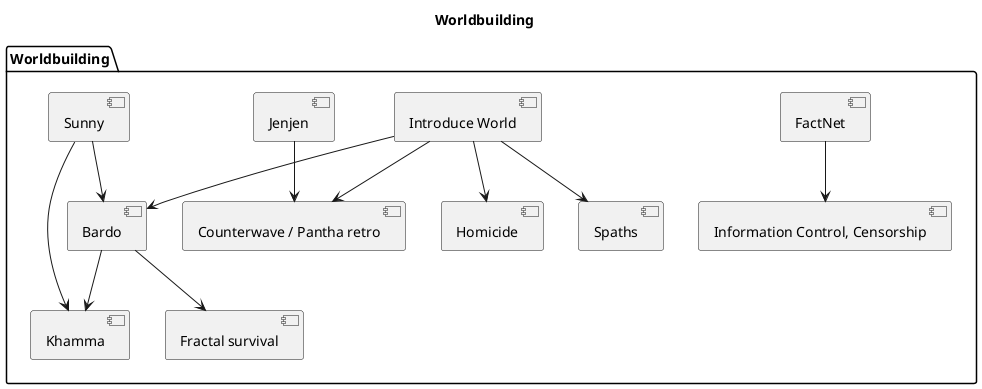
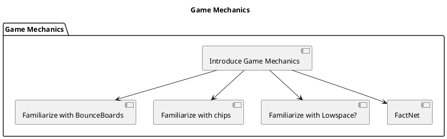
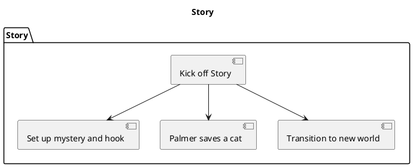
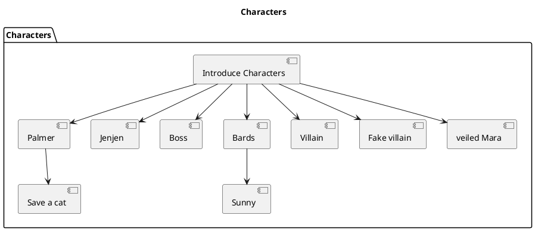
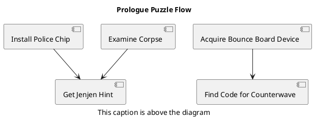

# Prologue (Act 0)

This folder contains the prologue design notes and PlantUML diagrams for Act 0.

## Table of Contents

- [Worldbuilding](worldbuilding.puml) — core setting elements to introduce.
- [Game Mechanics](game_mechanics.puml) — onboarding and core mechanics to teach.
- [Story](story.puml) — story beats to establish the hook.
- [Characters](characters.puml) — initial cast and relationships.
- [Prologue Puzzle Flow](eins.puml) — flow of player actions and puzzle outcomes for the prologue. asdf

---

## Worldbuilding

The player is introduced into the world. 
Palmer is not a fish-out-of water character with regards to most things, but he is old and out of touch with the latest technological developments. Jenjen will serve to some extend as introducing concepts via Palmer to the player. But other things will need to be established in different ways. Show, don't tell.

## Game Mechanics

This diagram lists the gameplay systems and onboarding priorities to introduce during the prologue.

Summary: Prioritize intuitive, low-risk ways for players to learn these mechanics.

## Story

This section lists the story beats that should be set up in the prologue.

Mystery must be set up to hook the characters and player. In a murder-less world, how can a murder still happen?

## Characters

This diagram lists the initial cast and important relationships introduced in the prologue.

Summary: Use the character list to ensure introductions and motivations are clear and consistent.

---

## Prologue Puzzle Flow

This section explains the Prologue Puzzle Flow diagram. It shows how player actions (installing chips,
examining the corpse, acquiring devices) lead to hints and puzzle outcomes (getting Jenjen hints,
finding codes). Use it to validate player progression and pacing.

Diagram file: `act0_puzzles.puml`

Summary: The puzzle flow diagram captures the essential player actions and their outcomes during the
prologue. Use it to guide puzzle design and ensure necessary signals and clues exist.
